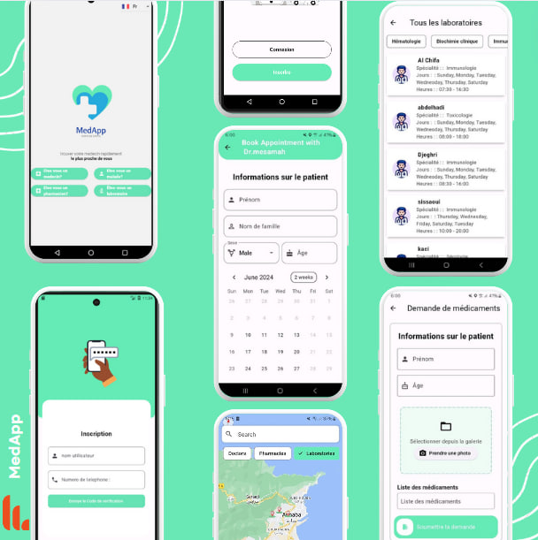

# MedApp

MedApp is a mobile application designed to improve access to medical services in Algeria. It enables users to locate medical specialists, book medical appointments online, and check the availability of medications in nearby pharmacies. The app leverages geolocation and other modern technologies to provide a user-friendly interface, and it is available in multiple languages including French, English, and Arabic.

## Technologies

The project is built using the following technologies:

- **Flutter**: For cross-platform mobile application development.
- **Firebase**: For backend services including authentication, database, and cloud storage.
- **Google Maps API**: For geolocation services and displaying maps.

## Project Demo

## Features

- **Geolocation**: Locate doctors, pharmacies, and laboratories in real-time.
- **Appointment Booking**: Book medical appointments online.
- **Medication Availability**: Check the availability of medications in nearby pharmacies.
- **Multilingual Support**: Available in French, English, and Arabic.
- **User-Friendly Interface**: Easy navigation and interaction.

